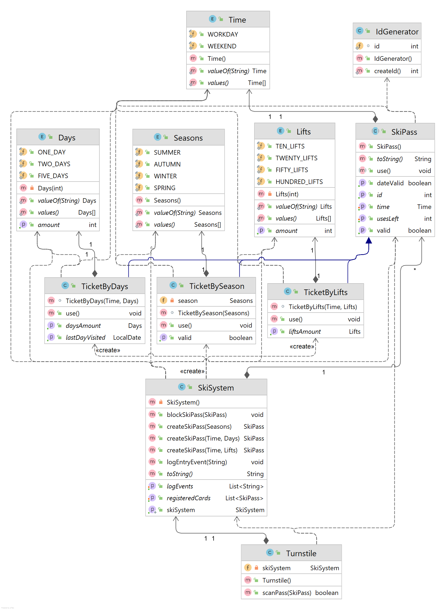

# Middle OOP. Alina Muliak
## skiPass

In this project ```SkiPass``` is an abstract class that are inherited by ```TicketByDays``` and ```TicketsByLifts```.
</br>There are 4 enums. ```Days```, ```Lifts```, ```Time``` and ```Season``` represent the property of certain ski pass.
</br>```SkiSystem``` is the class that is used to create or block ski pass, and log all scans of the ski passes.
Any pass cannot be created outside the ```ski_pass``` package as if not through ```SkiSystem```. 
</br>```Turnstile``` check if today's date is valid for the certain pass and if this pass is valid, if yes - uses it, else - blocks.

### the diagram of the project:

